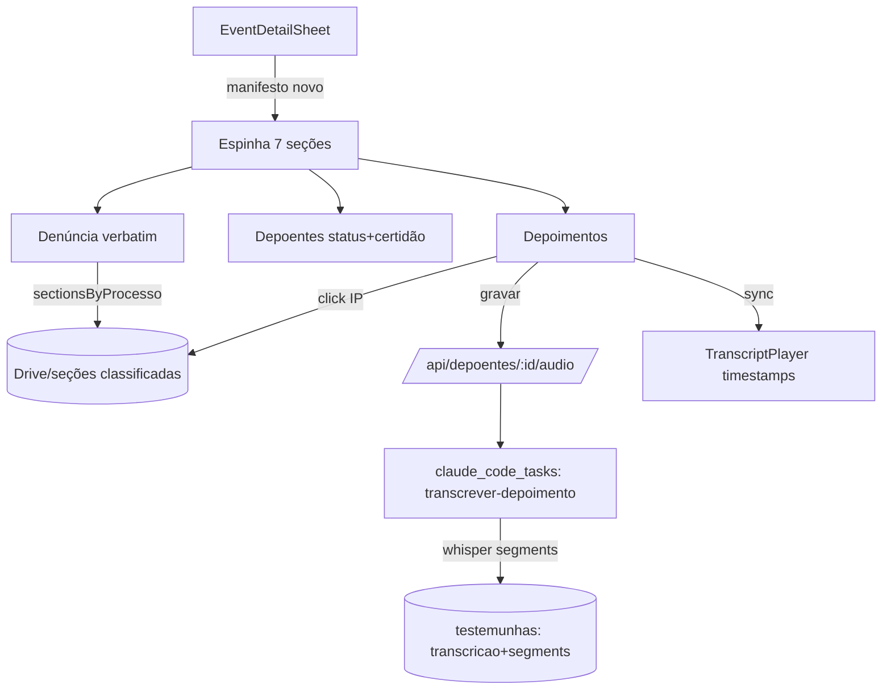

# TDD — Redesign do Sheet de Audiência de Instrução (AIJ)

| Campo | Valor |
|-------|-------|
| Tech Lead | @rodrigorochameire |
| Componente | `EventDetailSheet` (Agenda) |
| Status | Rascunho |
| Criado | 2026-06-24 |
| Atualizado | 2026-06-24 |
| Branch | `feat/sheet-instrucao-redesign` |

---

## Contexto

O `EventDetailSheet` (`src/components/agenda/event-detail-sheet.tsx`, ~1500 linhas) é o painel lateral que o defensor usa para preparar e conduzir audiências. Para o rito de **Instrução e Julgamento (AIJ)**, o corpo é dirigido por `SECOES_INSTRUCAO` (`src/components/agenda/sheet/secoes-manifest.ts`) e renderizado como seções colapsáveis com ToC (pills). Hoje há **~23 seções possíveis**, navegação por scroll, e profundidade desigual: depoimentos e ata são ricos; depoentes é só um grid de status; laudos é texto puro sem link; denúncia mostra só um *resumo* (`narrativa_denuncia`), não os termos da exordial.

**Domínio**: Agenda / Casos (instrução criminal).
**Stakeholders**: Defensores criminais (Júri, VVD, Criminal Geral, Execução).

---

## Definição do Problema

### Problemas
- **P1 — Poluição/organização**: 23 seções sem hierarquia clara; a ordem não segue o fluxo mental da instrução. Impacto: tempo perdido caçando informação durante a audiência.
- **P2 — Denúncia sem verbatim**: só há resumo da denúncia. O **princípio da correlação** exige conferir os **termos exatos da exordial** contra a prova produzida. Impacto: risco de não detectar mutatio/emendatio e nulidades.
- **P3 — Depoentes raso**: o painel de status não traz se foi intimado, e o **teor das certidões de diligência de comunicação processual** (mandado/AR/não localizado) — dado decisivo para arguir cerceamento/nulidade de intimação.
- **P4 — Depoimentos sem roteamento nem mídia útil**: não dá para, ao clicar, abrir o termo da delegacia (IP) ou reproduzir a mídia; não há gravação do depoimento no nível do depoente; não há navegação mídia↔transcrição.
- **P5 — Laudos sem prova**: laudos são texto; não linkam ao PDF/seção do laudo no processo.
- **P6 — Registro desintegrado**: o `RegistroAudienciaModal` existe como modal solto; falta a experiência de **registro vinculado** (como nas Demandas) dentro do sheet.

### Por que agora
A infra de gravação+transcrição via daemon (whisper-cli) acabou de entrar em produção no nível da **audiência**; replicá-la no **depoente** e somar timestamps destrava as features de maior valor da instrução.

### Impacto de não resolver
Defensores seguem com sheet poluído, sem verbatim para correlação e sem mídia navegável — perda probatória e de produtividade em audiência.

---

## Escopo

### ✅ Dentro (V1, faseado)
- **F1 — Reorg + header/pills**: espinha de 7 seções (Resumo executivo → Imputação → Denúncia → Depoentes → Depoimentos → Laudos → Documentos); grupo "Contexto" colapsado; Roteiro/Teses como faixa de preparação; refino de header (1 pill de status) e ToC.
- **F2 — Denúncia verbatim + Laudos linkados**: texto literal da exordial e laudos a partir das **seções classificadas** (`sectionsByProcesso`), com deep-link ao PDF.
- **F3 — Depoentes**: card por depoente com situação (ouvido juízo/IP/não), intimação e **teor da certidão de comunicação**.
- **F4 — Depoimentos power**: roteamento ao clicar (termo IP / mídia), **gravar depoimento do depoente** + transcrição via daemon, **sync mídia↔transcrição** por timestamps.
- **F5 — Registro no rodapé**: `RegistroAudienciaModal` integrado e vinculado (registro↔audiência↔processo↔assistido), anotação de audiência refinada.

### ❌ Fora (V1)
- Diarização (separar falantes) na transcrição.
- Edição inline do verbatim da denúncia (somente leitura + highlight).
- Reescrita do `RegistroAudienciaModal` (apenas integração/refino, não rebuild).

### 🔮 Futuro (V2+)
- Anotações ancoradas a timestamps do depoimento (marcar trechos).
- Comparador automático denúncia↔depoimentos para correlação.

---

## Solução Técnica

### Visão geral
Manter a engine de manifesto/ToC; trocar a **ordem e o agrupamento** (`SECOES_INSTRUCAO`) e elevar a profundidade de 4 seções (denúncia, depoentes, depoimentos, laudos). Reaproveitar ao máximo a infra existente (gravação de audiência, `DocumentosBlock`, `sectionsByProcesso`, daemon `claude_code_tasks`).

### Componentes principais
- `secoes-manifest.ts` — nova `SECOES_INSTRUCAO` (ordem + grupo Contexto).
- `secoes/DenunciaSecao.tsx` (novo) — verbatim via `sectionsByProcesso`.
- `secoes/DepoentesSecao.tsx` (evolui `PainelDepoentesStatus`) — situação + certidão.
- `depoente-card-v2.tsx` (evolui) — roteamento IP/mídia + gravar + sync.
- `transcript-player.tsx` (novo) — player com segmentos clicáveis.
- `gravar-depoimento.tsx` (novo, clone de `gravar-audiencia.tsx`).
- `secoes/LaudosSecao.tsx` (novo) — laudos linkados.
- `sheet-action-footer.tsx` (evolui) — Registro integrado.

### Fluxo de dados (depoimento power)
1. Defensor clica "gravar" no card do depoente → `gravar-depoimento.tsx` (MediaRecorder).
2. Upload → `POST /api/depoentes/[id]/audio` → Drive → `testemunhas.depoimentoAudioDriveFileId` + `transcricaoStatus='pending'`.
3. Enfileira `claude_code_tasks` skill `transcrever-depoimento` (whisper-cli **com segmentos**).
4. Daemon grava `testemunhas.depoimentoTranscricao` + `depoimentoSegments` (jsonb `[{start,end,text}]`) + `transcricaoStatus='completed'`.
5. `getAudienciaContext` retorna; `TranscriptPlayer` lê `segments`; clique no segmento faz `audio.currentTime = start`.

### APIs & Endpoints (tRPC / rotas)
| Procedure/Rota | Tipo | Descrição |
|---|---|---|
| `POST /api/depoentes/[id]/audio` | route (novo) | Upload gravação do depoente → Drive → enfileira daemon (clone de `/api/audiencias/[id]/audio`) |
| `audiencias.getDepoenteMidia` | query (novo) | Retorna `{audioDriveFileId, transcricao, segments, transcricaoStatus}` do depoente (polling) |
| `drive.sectionsByProcesso` | query (existe) | Seções classificadas (Denúncia, Laudo, Termo IP) — **confirmar se retorna texto extraído** |
| `audiencias.vincularAudioDepoente` | mutation (existe) | Vincular áudio Drive a depoente |

### Mudanças no Banco
**Alterar `testemunhas`** (mesmo padrão idempotente já usado nesta tabela — ALTER direto + schema):
- `depoimento_audio_drive_file_id` varchar(100)
- `depoimento_audio_url` text
- `depoimento_transcricao` text
- `depoimento_segments` jsonb `Array<{start:number,end:number,text:string}>`
- `depoimento_transcricao_status` varchar(20)
- `certidao_comunicacao` text (teor da certidão; populado pela skill de sistematização)

> ⚠️ A tabela `testemunhas` já tem `audioDriveFileId` (link genérico). Os novos campos são específicos do **depoimento gravado em juízo** para não colidir com áudios linkados manualmente.

### Daemon
- Nova skill `transcrever-depoimento` (clone de `transcrever-audiencia`), **com `-oj`/segmentos** do whisper-cli → grava `depoimento_segments`. Allowlist no `.gitignore`.

---

## Riscos
| Risco | Impacto | Prob. | Mitigação |
|---|---|---|---|
| `sectionsByProcesso` não extrai **texto** (só PDF) | Alto (gate F2) | Média | Confirmar formato; se só PDF, exibir viewer + pedir extração à skill de sistematização (decisão V1.1) |
| Certidão de comunicação sem fonte estruturada | Médio (gate F3-certidão) | Alta | Faseado: status de intimação já existe; certidão entra quando a skill emitir `certidao_comunicacao` |
| Daemon offline (SSH M4 Pro pendente) | Médio | Alta | Gravação/upload funcionam; transcrição fica `pending` e drena ao subir daemon |
| Churn de branch paralelo (sessão atual) | Médio | Alta | Branch dedicada + commits frequentes; subagents em worktree isolado |
| Sync timestamps impreciso | Baixo | Média | whisper segment-level é suficiente; palavra-a-palavra fica V2 |

---

## Plano de Implementação (fases → spec-driven)
| Fase | Entrega | Estim. |
|---|---|---|
| **F1** | Manifesto novo + header/pills + grupo Contexto | 2d |
| **F2** | Denúncia verbatim + Laudos linkados (`sectionsByProcesso`) | 2d |
| **F3** | Depoentes (situação + intimação + certidão) | 2d |
| **F4** | Depoimentos: roteamento + gravar depoente + daemon + TranscriptPlayer sync | 4d |
| **F5** | Registro integrado no rodapé | 2d |

Cada fase vira um arquivo de tasks em `/spec-driven`; execução por **subagents** (1 subagent por fase em worktree isolado, verificação adversarial).

---

## Considerações de Segurança
- Todas as rotas/queries com `protectedProcedure` / sessão (`verifySessionToken`), como em `/api/audiencias/[id]/audio`.
- Áudio de depoimento = dado sensível: sobe para a **pasta do assistido** no Drive (ACL existente), nunca público.
- Transcrição via daemon local (whisper-cli no M4 Pro), **sem API externa** — segue a política de não enviar conteúdo de autos a terceiros.
- Verbatim da denúncia é só-leitura; sem PII nova exposta além do que já está nos autos vinculados.

## Estratégia de Testes (TDD)
| Tipo | Escopo | Abordagem |
|---|---|---|
| Unit (Vitest) | Novo manifesto `SECOES_INSTRUCAO` (ordem/grupo), utils de segments (seek), parser de certidão | `src/lib/agenda/__tests__/` + `secoes-manifest.test.ts` |
| Unit | `gravar-depoimento` utils (reusa `gravacao-audio.ts`) | Estender testes existentes |
| Integração | rota `/api/depoentes/[id]/audio` (mock Drive) | Test do enqueue de `claude_code_tasks` |
| Manual/Browser | Sheet AIJ por subtipo, sync mídia↔transcrição | `/browser-test` |

**TDD obrigatório**: cada util novo (ordem do manifesto, seek por segmento, mapeamento depoente→termo IP) começa por teste.

## Monitoramento
- `transcricao_status` por depoente (índice) — visibilidade de fila/falha.
- Log estruturado no enqueue (já padrão nas rotas de áudio).

## Plano de Rollback
- Feature-flag por **manifesto**: reverter `SECOES_INSTRUCAO` para a ordem antiga restaura o sheet atual (mudança é de configuração, não destrutiva).
- Colunas novas em `testemunhas` são aditivas/nullable → sem rollback de dados.
- Cada fase é um PR independente → reverter PR isolado.

## Decisões abertas (confirmar antes da fase respectiva)
1. **F2**: `sectionsByProcesso` retorna texto extraído ou só PDF? (define verbatim inline vs viewer)
2. **F2/F4**: laudo e termo IP — linkar à seção classificada vs PDF avulso extraído. Recomendação: **seção classificada** (consistente com a skill de sistematização).
3. **F3**: fonte da certidão de comunicação — skill de sistematização emite `certidao_comunicacao`? Senão, F3 entrega status sem certidão e a certidão entra depois.

---

## Glossário
| Termo | Definição |
|---|---|
| **Correlação** | Princípio que vincula a sentença aos fatos da denúncia; exige conferir os termos da exordial. |
| **Termo de depoimento (IP)** | Peça do inquérito com o depoimento colhido na delegacia. |
| **Certidão de comunicação** | Certidão do oficial sobre cumprimento de mandado/intimação (cumprido, não localizado, AR). |
| **AIJ** | Audiência de Instrução e Julgamento (art. 400 CPP). |
