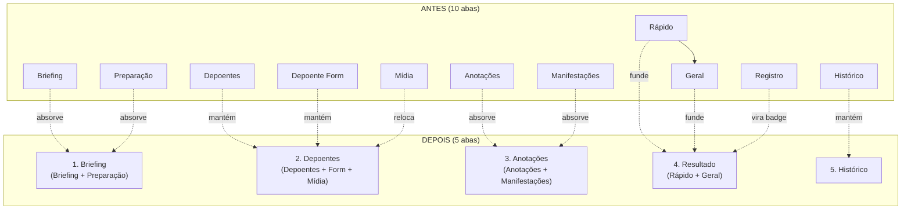

# TDD — Redesign do Modal de Registro de Audiência

| Campo | Valor |
|-------|-------|
| Tech Lead | Rodrigo Rocha Meire |
| Status | Rascunho |
| Criado | 2026-04-09 |
| Atualizado | 2026-04-09 |

---

## Contexto

O modal de registro de audiência é o componente central do fluxo operacional do OMBUDS durante a pauta diária. Ele é aberto pelo defensor antes, durante e depois de cada audiência para consultar o briefing do caso, registrar depoimentos em tempo real, anotar manifestações das partes e salvar o resultado.

O modal foi construído incrementalmente ao longo de meses, acumulando 10 abas ("Rápido", "Geral", "Briefing", "Preparação", "Depoentes", "Depoente Form", "Anotações", "Manifestações", "Mídia", "Registro", "Histórico"). Isso resultou em duplicação de campos, confusão sobre onde encontrar cada informação e navegação lenta — exatamente o oposto do que o defensor precisa em audiência (velocidade e clareza).

**Domínio**: Agenda / Audiências

**Stakeholders**: Defensores públicos (9ª DP Camaçari), estagiários, servidores

---

## Definição do Problema

### Problemas que Estamos Resolvendo

- **10 abas é demais**: O defensor não sabe qual aba abrir para qual campo. "Resultado" está em "Geral" ou "Rápido"? "Encaminhamentos" em "Manifestações"? A navegação consome tempo que o defensor não tem durante a audiência.
  - Impacto: ~15s perdidos por campo buscado × ~8 campos por audiência × ~9 audiências/dia = ~18min/dia desperdiçados em navegação

- **Duplicação Rápido ↔ Geral**: Ambas as abas contêm os mesmos campos (status, comparecimento, resultado, redesignação). Não há razão para existirem separadas.

- **Abas com pouco conteúdo**: "Anotações" é 1 textarea. "Manifestações" são 3 textareas. Não merecem aba própria — poderiam ser campos numa aba maior.

- **Briefing e Preparação separados**: Ambas são "antes da audiência" mas estão em abas diferentes sem razão lógica.

- **Juiz e Promotor sem campo**: Existem no banco (`audiencias.juiz`, `audiencias.promotor`) mas não aparecem no modal. O defensor não tem como registrar quem presidiu.

- **Sem auto-save**: Se o defensor fecha o modal sem clicar "Salvar", perde tudo. Em audiência (conexão instável, bateria baixa, interrupções), isso é crítico.

### Por Que Agora?

- A pauta VVD de 09/04/2026 (9 audiências) evidenciou a dor: os dossiês de análise foram gerados automaticamente mas o modal não estava preparado para exibi-los de forma útil
- A integração IA→audiência (análise automática → briefing → registro → pós-audiência) depende de um modal enxuto e rápido

### Impacto de NÃO Resolver

- **Defensores**: continuam perdendo tempo navegando entre abas durante audiências, arriscando perder registros por falta de auto-save
- **Sistema**: os dados gerados pela análise IA (resumo_defesa, anotacoes, teses) não chegam ao defensor de forma fluida

---

## Escopo

### ✅ Dentro do Escopo (V1)

- Consolidar 10 abas em 5 abas (Briefing, Depoentes, Anotações, Resultado, Histórico)
- Adicionar campos Juiz e Promotor no header do modal
- Badge de completude no footer
- Auto-save a cada 30s
- Mover upload de mídia para dentro de Depoentes (por depoente)
- Separar tipo de depoente em "acusação" / "defesa" / "informante"

### ❌ Fora do Escopo (V1)

- Modo offline com localStorage (V2)
- Integração com gravação de áudio em tempo real (V2)
- Comparação automática entre briefing IA e registro real (V2)
- Mobile-first redesign completo (V2)

### 🔮 Considerações Futuras (V2+)

- Modo offline resiliente para comarcas rurais
- Timer automático por depoente (tempo de oitiva)
- Transcrição de áudio → texto para depoimentos
- Sugestões de perguntas IA durante a audiência (contextual)

---

## Solução Técnica

### Visão Geral

Reorganização de componentes React sem mudança no schema do banco, no router tRPC nem no tipo `RegistroAudienciaData`. Todo o conteúdo é preservado — apenas a disposição nas abas muda.



### Mapeamento Campo a Campo

| Campo | Aba Origem | Aba Destino |
|-------|-----------|-------------|
| Status audiência (concluída/redesignada/suspensa) | Rápido + Geral | **Resultado** |
| Comparecimento assistido | Geral | **Resultado** |
| Revelia | Geral | **Resultado** |
| Resultado da audiência | Geral | **Resultado** |
| Tipo extinção | Geral | **Resultado** |
| Redesignação (motivo, data, horário, testemunha) | Geral | **Resultado** |
| Encaminhamentos | Manifestações | **Resultado** |
| BriefingSection (read-only) | Briefing | **Briefing** |
| Preview preparação + importar depoentes | Preparação | **Briefing** (colapsável) |
| Lista depoentes + form inline | Depoentes | **Depoentes** |
| Upload mídia / gravações | Mídia | **Depoentes** (seção por depoente) |
| Atendimento prévio | Anotações | **Anotações** |
| Estratégias de defesa | Anotações | **Anotações** |
| Anotações gerais | Anotações | **Anotações** |
| Manifestação MP | Manifestações | **Anotações** |
| Manifestação Defesa | Manifestações | **Anotações** |
| Decisão Juiz | Manifestações | **Anotações** |
| Completude / preview | Registro | **Footer** (badge) |
| Histórico | Histórico | **Histórico** |

### Componentes

**Novos arquivos:**
- `tabs/tab-resultado.tsx` — fusão de tab-rapido + tab-geral + encaminhamentos

**Arquivos modificados:**
- `registro-modal.tsx` — header enriquecido (juiz/promotor), 5 abas, footer com badge
- `tabs/tab-briefing.tsx` — absorve tab-preparacao como seção colapsável
- `tabs/tab-anotacoes.tsx` — absorve 3 campos de tab-manifestacoes
- `tabs/tab-depoentes.tsx` — absorve seção de mídia
- `hooks/use-registro-form.ts` — `TabKey` de 10 para 5 valores + auto-save

**Arquivos deletados:**
- `tabs/tab-rapido.tsx`
- `tabs/tab-geral.tsx`
- `tabs/tab-preparacao.tsx`
- `tabs/tab-manifestacoes.tsx`
- `tabs/tab-midia.tsx`
- `tabs/tab-registro.tsx`

### Mudanças no Backend

**Router** (`audiencias.ts`): nova mutation lightweight:
```typescript
atualizarHeader: protectedProcedure
  .input(z.object({
    audienciaId: z.number(),
    juiz: z.string().optional(),
    promotor: z.string().optional(),
  }))
  .mutation(...)
```

**Schema**: nenhuma mudança. `juiz` e `promotor` já existem na tabela `audiencias`.

**Tipos**: `RegistroAudienciaData` (em `types.ts`) não muda — todos os campos preservados.

### Auto-save

```typescript
// Em use-registro-form.ts
useEffect(() => {
  const timer = setInterval(() => {
    if (isDirty && !isSaving) {
      saveRegistro();
    }
  }, 30_000);
  return () => clearInterval(timer);
}, [isDirty, isSaving]);
```

Indicador visual: badge "Salvo ✓" / "Salvando..." no footer.

---

## Riscos

| Risco | Impacto | Probabilidade | Mitigação |
|-------|---------|---------------|-----------|
| Regressão de campos ao fundir abas | Alto | Média | Mapeamento campo-a-campo explícito; testar cada campo no modal final |
| Auto-save gera race condition com save manual | Médio | Baixa | Mutex no hook; debounce; `isSaving` guard |
| Props perdidas na refatoração dos sub-componentes | Alto | Média | Grep para todos os `registro.` e `updateRegistro` antes e depois |
| Tab "Resultado" fica grande demais | Baixo | Média | Seções condicionais com AnimatePresence (já existem no tab-geral) |
| Mídia relocada para Depoentes quebra queries tRPC | Médio | Baixa | tab-midia já é self-contained; importar como sub-componente |

---

## Plano de Implementação

| Fase | Tarefa | Descrição | Status |
|------|--------|-----------|--------|
| **1 — Criar** | `tab-resultado.tsx` | Fusão de tab-rapido + tab-geral + encaminhamentos | ⬜ |
| **1 — Criar** | `tab-briefing.tsx` v2 | Absorver tab-preparacao como seção colapsável | ⬜ |
| **1 — Expandir** | `tab-anotacoes.tsx` | Adicionar 3 campos de manifestações | ⬜ |
| **1 — Expandir** | `tab-depoentes.tsx` | Adicionar seção mídia colapsável | ⬜ |
| **2 — Rewire** | `registro-modal.tsx` | Trocar 10→5 abas, header enriquecido, footer badge | ⬜ |
| **2 — Rewire** | `use-registro-form.ts` | TabKey para 5 valores, auto-save | ⬜ |
| **3 — Backend** | `audiencias.ts` | Mutation `atualizarHeader` (juiz/promotor) | ⬜ |
| **4 — Limpar** | Deletar 6 arquivos | tab-rapido, tab-geral, tab-preparacao, tab-manifestacoes, tab-midia, tab-registro | ⬜ |
| **5 — Testar** | Todas as permutações | Concluída, redesignada, suspensa, com/sem depoentes, com/sem histórico | ⬜ |
| **5 — Build** | `npm run build` | Verificar zero erros TS | ⬜ |

---

## Considerações de Segurança

### Autenticação & Autorização
- Sem mudança — usa `protectedProcedure` existente
- Verificação de acesso por defensor (isolamento) já implementada

### Proteção de Dados
- Dados sensíveis (depoimentos, manifestações) continuam no JSONB `registroAudiencia`
- Auto-save não altera a segurança: mesma mutation `salvarRegistro` já existente
- Nenhum dado novo exposto

---

## Estratégia de Testes

| Tipo | Escopo | Abordagem |
|------|--------|-----------|
| Manual | Abrir modal, preencher todos os campos, salvar, reabrir | Verificar que nenhum campo sumiu |
| Manual | Todas as permutações de status (3 estados × depoentes × redesignação) | Screenshots antes/depois |
| Build | `npm run build` sem erros TS | CI |

### Cenários Críticos
- ✅ Abrir modal → preencher status "Redesignada" → campos de redesignação aparecem → salvar → reabrir → dados preservados
- ✅ Abrir modal → ir para Depoentes → adicionar 3 → salvar → reabrir → 3 depoentes presentes
- ✅ Abrir modal → preencher manifestações em "Anotações" → salvar → reabrir → 3 campos com valor
- ✅ Header: editar juiz/promotor → salvar → reabrir → valores preservados
- ✅ Auto-save: preencher campo → esperar 30s → fechar sem clicar Salvar → reabrir → dados presentes

---

## Plano de Rollback

### Triggers
| Trigger | Ação |
|---------|------|
| Campo perdido após deploy | Reverter deploy Vercel (1 clique) |
| JSONB corrompido | Rollback impossível → fix forward |

### Passos
1. **Reverter deploy** via Vercel dashboard (< 1 min)
2. Sem rollback de banco necessário (schema não muda)
3. Branch preservada para fix forward se necessário

---

## Checklist de Validação

### Seções Obrigatórias
- [x] Contexto com problemas quantificados
- [x] Escopo claro (dentro/fora)
- [x] Mapeamento campo-a-campo completo
- [x] Diagrama de arquitetura (mermaid)
- [x] Riscos com mitigação
- [x] Plano de implementação com fases

### Seções Críticas (OMBUDS)
- [x] Segurança: sem mudança no modelo de acesso
- [x] Testes: cenários manuais + build
- [x] Rollback: reverter deploy Vercel
